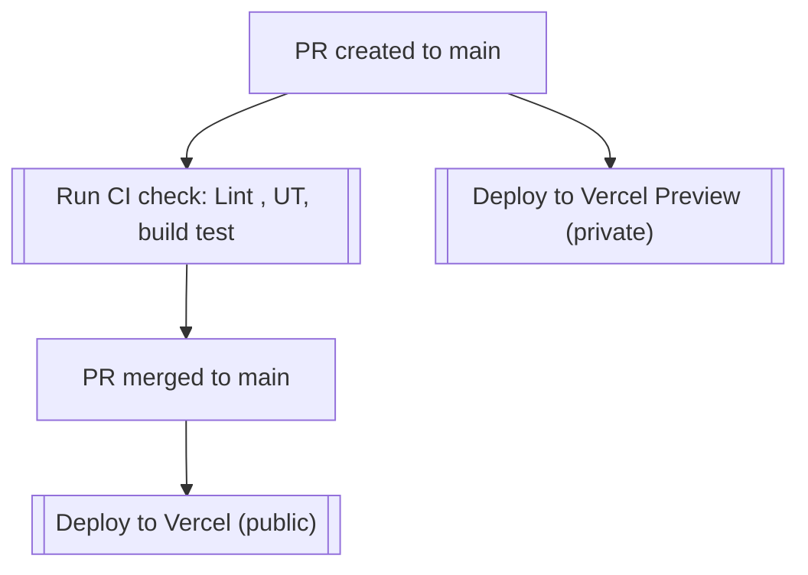
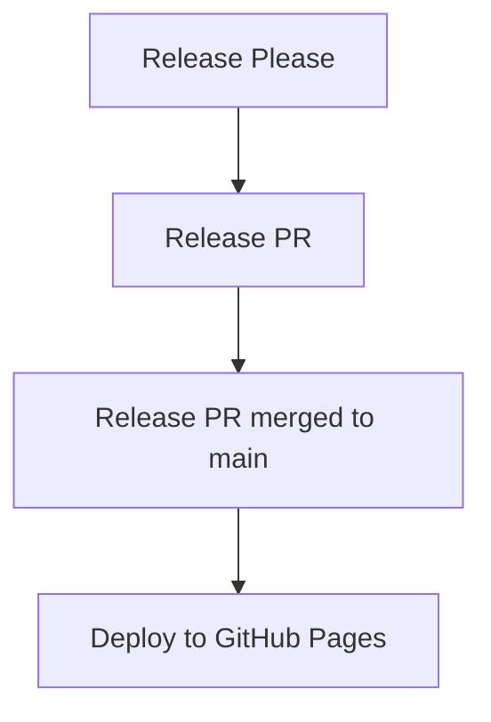

# Contributor Guide

Welcome to the Faith Toolbox project! We appreciate your interest in contributing. This guide outlines the process for contributing both as a developer and as a non-developer.

Join us in the [Discord](https://discord.gg/SWRHyas2) to discuss the project.

---

## Developer Contribution Guide

### Getting Started

Prepare the project:

```bash
npm install
npm run prepare
```

First, run the development server:

```bash
npm run dev
```

Open [http://localhost:3000](http://localhost:3000) with your browser to see the result.

You can start editing the page by modifying `app/page.tsx`. The page auto-updates as you edit the file.

### 1. Contribution Process

To contribute as a developer:

1. **Fork the Repository**: Start by forking the repository to your own GitHub account.
2. **Clone Your Fork**:
   ```bash
   git clone https://github.com/<your-username>/faith-toolbox.git
   cd faith-toolbox
   ```
3. **Create a Branch**:

   - Use the following naming convention for your branch:
     ```
     <type>/<short-description>
     ```
     For example:
     - `feat/add-i18n`
     - `fix/mobile-view`

   ```bash
   git checkout -b feat/your-feature-name
   ```

4. **Commit Changes**: Follow the [Conventional Commits](https://www.conventionalcommits.org/en/v1.0.0/) guidelines:

   ```
   <type>(optional app-name): <short summary>
   ```

   Examples:

   - `feat(bible-reading-app): add book ordering input`
   - `chore: making unit test faster`

   **Conventional Commit Types**:

   - `feat`: A new feature.
   - `fix`: A bug fix.
   - `docs`: Documentation changes.
   - Refer to [release please config](https://github.com/schwannden/faith-toolbox/blob/main/release-please-config.json#L12) for more types.

5. **Push Your Changes**:

   ```bash
   git push origin feat/your-feature-name
   ```

6. **Create a Pull Request (PR)**:
   - Go to the original repository: [Faith Toolbox](https://github.com/schwannden/faith-toolbox)
   - Click "New Pull Request".
   - Provide a clear description of your changes.

---

## Non-Developer Contribution Guide

If you aren't coding but still want to help, please contribute by reporting issues or suggesting ideas!

1. **Go to Issues**:

   - Navigate to the [Issues Tab](https://github.com/schwannden/faith-toolbox/issues).
   - Search for existing issues or [create a new one](https://github.com/schwannden/faith-toolbox/issues/new/choose).

2. **Create a New Issue**:

   - Select the appropriate issue type:

     - 🐛 **Bug Report**: Report any bugs or unexpected behavior.
     - ✨ **Feature Request**: Suggest a new feature or improvement.

   - Fill out the issue template clearly and provide as much detail as possible.

---

## Deploy Strategy

### Preview Environment



### Production Environment



---

## Learn More

To learn more about Next.js, take a look at the following resources:

- [Next.js Documentation](https://nextjs.org/docs) - learn about Next.js features and API.
- [Learn Next.js](https://nextjs.org/learn) - an interactive Next.js tutorial.

---

Thank you for helping make the Faith Toolbox better! 🌟
